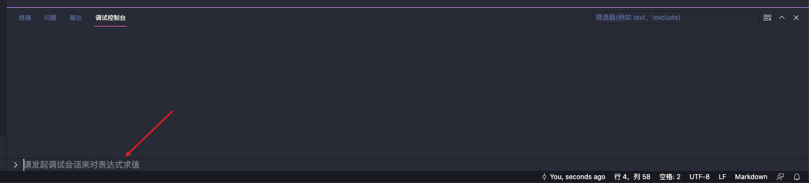

## <font color=#c88afa>背景：</font><br />
<font color=#00ffff>最近在负责一个爬虫项目，在爬完一页数据保存前 debug查看数组中的数据，有时需要再优化，有时发现数据结构需要再处理一下。<br />
难道改完代码再爬一遍？如果能保存当前这个数组到一个JSON文件中，下次直接require这个JSON，岂不是完美？
<br />
最初的解决方案是 在调试控制台使用JSON.stringfy(dataList)，将结果复制到js文件中，并把它赋值给一个变量，在执行JSON.parse(varible)却报错了。<br />
很显然，JSON.stringfy()函数并不是完美的解决方案。<br/>
**<font color=#FF0000>Tips：如果您还不知道vscode编辑器如何debug JavaScript代码，请先使用搜索引擎搜索vscode debug JavaScript。</font><br />**
众所周知，在debug 断点时 调试控制台是可以执行代码的，也可以输入程序运行中的变量来看到它的值。<br /></font>


##  <font color=#c88afa>描述：</font><br />
<font color=#00ffff>在debug断点时，可以将任何类型的变量，输出到指定路径的JSON文件中</font><br />

##  <font color=#c88afa>Web服务中引入：</font><br />
<font color=#00ffff>
仅需两行代码，即可在代码里 或 debug断点的时候 使用调试控制台保存程序中的变量<br /><br />

**<font color=#FF0000>Tips：下面两行代码推荐放在入口文件(app.js 或 index.js)或是声明global变量的文件中。</font>**<br />

``` const { saveVarible } = require('write-debug-varible'); ```<br />
``` global.saveVarible = saveVarible; ```<br />

</font>

##  <font color=#c88afa>单JS文件中引入：</font><br />
<font color=#00ffff>

``` const { saveVarible } = require('write-debug-varible'); ```
</font><br />

##  <font color=#c88afa>如何调用：</font><br />
<font color=#00ffff>

``` saveVarible("./file.json", varible); ```&nbsp;&nbsp;&nbsp;// 该行无论是放到代码里 还是 debug断点的时候使用调试控制台执行都可以<br />
即可在当前项目中看到生成的JSON文件
</font><br />
